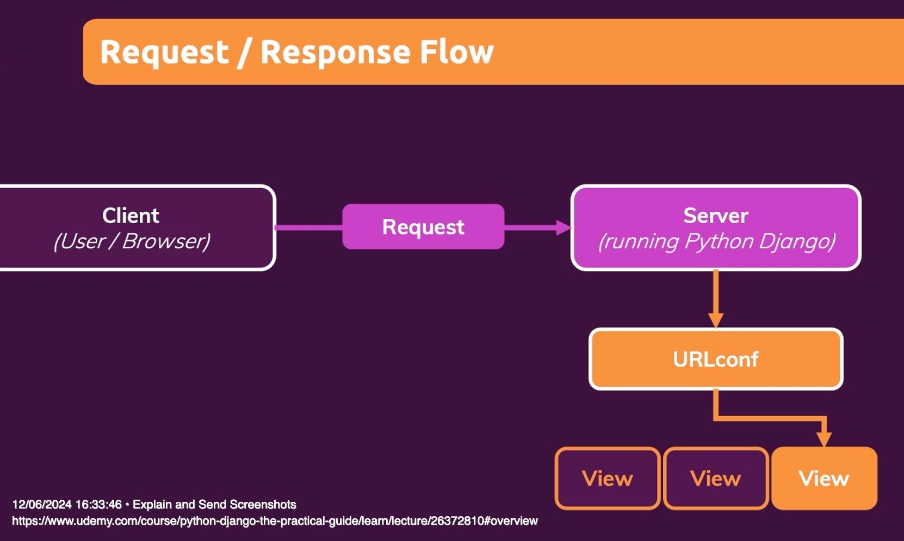

## What is a View
1. It is logic that is executed for different urls and http methods.
2. A view is one of the following in Django is a **function or a class** full of Python code, which is executed automatically by Django when a request for a certain URL reaches the Django server.
3. The code in that view is simply code that handles the incoming request, does something like reach out to a database or whatever and then returns a fitting response.

**RequestResponse Flow**

## Templates
Documentation :
1. https://docs.djangoproject.com/en/5.0/ref/templates/
2. https://docs.djangoproject.com/en/5.0/ref/templates/language/#tags
3.

Todo:
1. Create a template that inherits a base.html and also includes a snippet template.
2. Create the 404.html and use Http404() in the view.

Step 1

    Phone Number
    First & Last Name
    Gender

Step 2

    Date of Birth
    Smoking
    Drinking
    Previous Infections
    Fertility Status
    Menstrual Issues

# Misc

views.py
moduledictonary = {
  "simplehttpresponse": "Return simple text",
  "dynamicpathsegment": "We can call different views based on the datatype of the pathparameter",
  "shallwe_redirect": "We can redirect to another url from a view using hardcoded urls",
  "shallwe_redirect_namedurl": "We can redirect to another url from a view using named urls",
  "returnhtml": "We can return a string in html format",
  "returnhtmltemplate": "We can returl a static html file",
  "returndynamichtmltemplate": "We can returl a dynamic html file i.e where we can pass in values from the view to the html file",
  None: "sss"
}

# Create your views here.

# We create a function based view.
# In this view we just return a simple http response without any fancy html etc..
def simplehttpresponse(request):
    return HttpResponse("This is a simple http response")

# We create another function based view.
# We are showcasing a dynamic path segment here
# In this view also take the parameter that was passed in the url path and use that in the response txt
# In the url pattern that is mapped to this view, the value that is between <> is passed to this function.
# The value between the <> in the url pattern should match the argument name in the view function.
def dynamicpathsegment(request, pathparameter):
    responsetext = "This is a dyamic http respose where " + pathparameter + " was passed and it is a string"
    return HttpResponse(responsetext)
# We created this view to show that we could call different views based on the type of pathparameter.
# So if its an integer dynamicpathsegment_bynumber is called , else dynamicpathsegment is called. This is define din the urls.py
def dynamicpathsegment_bynumber(request, pathparameter):
    responsetext = "This is a dyamic http respose where " + str(pathparameter) + " was passed and it is a number"
    return HttpResponse(responsetext)

# We are showcasing a redirect in the below two views.
# In the shallwe_redirect view, we take the pathparameter and check its value.
# if it is equal to redirect then we return a redirect url /module/shallweredirect/yes.
# Django goes back to the urls.py and sees which view needs to be called for this url pattern.
# It sees that shallwe_redirect_yes needs to be called and so that view is called.
# if the pathparameter passed is not redirect then it just returns a httpresponse like normal.
def shallwe_redirect(request, pathparameter):
    print(pathparameter)
    if pathparameter == "redirect":
        print("entered if")
        return HttpResponseRedirect("/module/shallweredirect/yes")
    else :
        print("entered else")
        responsetext = "Redirect has not happened because " + pathparameter + " was passed"
        return HttpResponse(responsetext)
def shallwe_redirect_yes(request, pathparameter):
    responsetext = "Redirect has happened because " + pathparameter + " was passed"
    return HttpResponse(responsetext)

# We are showcasing a redirect using a named url in the below two views.
# We have already set up the url patterns in the urls.py
# The shallwedo_named_url_redirect checks the pathparameter passed.
# if it is redirect, then it retreives the url for named-url from urls.py and concatenates that with /yes and sends a httpresponseredirect which directs it to the shallwedo_named_url_redirect_yes view as per the urls.py
# if it is not redirect, then it just returns a normal httpresponse.
def shallwedo_named_url_redirect(request, pathparameter):
    if pathparameter == "redirect":
        namedurl = reverse("named-url", args = [pathparameter])
        print(namedurl)
        return HttpResponseRedirect(namedurl + "/yes")
    else :
        responsetext = "Named Url Redirect has not happened because " + pathparameter + " was passed"
        return HttpResponse(responsetext)
def shallwedo_named_url_redirect_yes(request):
    responsetext = "Named Url Redirect has happened because redirect " + " was passed"
    return HttpResponse(responsetext)

# The below 2 views showcase that we can return html in the respose
# So what we do in this view is return html which contains a link which when clicked takes us to
# that url and returns the appropriate response as defined in its respective view
def returnhtml(request):
    namedurl = reverse("simple-html-response")
    responsetext= f"<ul><li><a href=\"{namedurl}\">simplehtmlresponse</a></li>"+"</ul>"
    return HttpResponse(responsetext)

def simplehtmlresponse(request):
    return HttpResponse("<h1>This is a simple http response</h1>")

# The below view showcases how we can return a static html file or template
# We need to update the settings.py to include the module app int the list of installed apps.
# Otherwise it wont look in the module/templates/module folder for the html file.
# Its a good practice o store the template file in a folder named after your app within the templates folder.
# This is because there could be many apps within your main project and some of them could have the same html file name. So Django would not know which one to load.
def returnhtmltemplate(request):
        response_data = render_to_string("module/statichtml.html")
        return HttpResponse(response_data)
        # You can also use return render("module/module.html")

# The below view showcases how we can return a dynamic html file or template
# This is similar to the returnhtmltemplate above except that we pass in
def returndynamichtmltemplate(request):
        views = list(moduledictonary.keys())
        simplehtmlresponse = moduledictonary["simplehttpresponse"]
        # we can pass the variable we create above as shown below with the name text.
        return render(request,"module/dynamichtml.html",{
            "text": simplehtmlresponse,
            "moduletitle":"Module Views",
            "views": views

        })

urls.py

 # We are telling Django that for a /module/simplehttpresponse url pattern, it should call the simplehttpresponse view.
    path('simplehttpresponse', views.simplehttpresponse),
    # We are telling Django that for a /module/dynamichttpresponse/...  url pattern, it should call the dynamicpathsegment view.
    # The value that is passed after the dynamichttpresponse/ in the url is also passed to the view automatically function as you will see in the views.py
    # The value between the <> should match the argument name in the view function.
    # The str tells Django that it should be handled as a string
    # The int tells Django that if the passed in value can be converted to an int, then it should call the dynamicpathsegment_bynumber view
    # if not then it calls the dynamicpathsegment view.
    # These are called path converters.
    path('dynamichttpresponse/<int:pathparameter>', views.dynamicpathsegment_bynumber),
    path('dynamichttpresponse/<str:pathparameter>', views.dynamicpathsegment),
    # The below 2 url patterns are defined to show case the ability of a view to return a redirect to another url .
    path('shallweredirect/<pathparameter>', views.shallwe_redirect),
    path('shallweredirect/yes/<pathparameter>', views.shallwe_redirect_yes),
    # The below 2 url patterns are defined to show how to use named urls. By ggiving a utl pattern a name, we can retrive the url pattern by using that name in the views.
    path('shallwedoanamedurlredirect/<pathparameter>', views.shallwedo_named_url_redirect, name = "named-url"),
    path('shallwedoanamedurlredirect/redirect/yes', views.shallwedo_named_url_redirect_yes),
    # The below url patern is to demonstrate that we can return html in the view.
    path('simplehtmlresponse', views.simplehtmlresponse, name="simple-html-response"),
    path('returnhtml', views.returnhtml),
    # The below url pattern is to demostrate that we can return static html stored in a html template file
    path('returnhtmltemplate', views.returnhtmltemplate, name="returnhtmltemplate"),
    # The below url pattern is to demostrate that we can return dynamic html stored in a html template file
    path('returndynamichtmltemplate', views.returndynamichtmltemplate),

